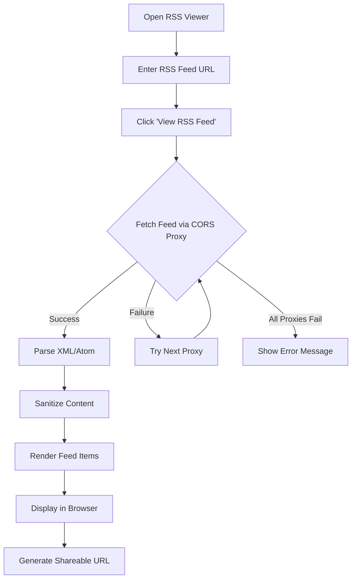
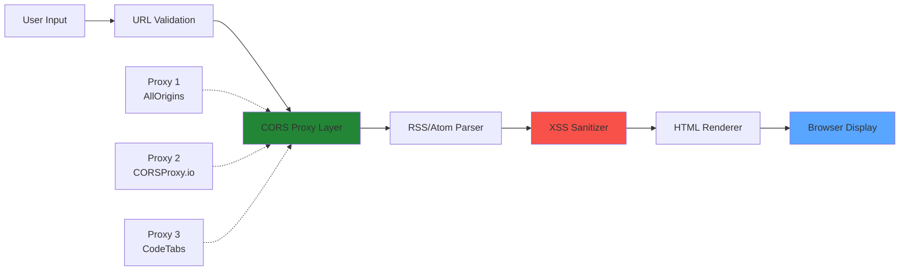

# 📡 xsukax RSS Viewer

A professional, privacy-focused RSS feed reader that runs entirely in your browser. View and share RSS/Atom feeds without compromising your privacy or requiring server-side infrastructure.

[](https://www.gnu.org/licenses/gpl-3.0)
[](https://github.com/xsukax/xsukax-RSS-Viewer)

## 📋 Project Overview

xsukax RSS Viewer is a lightweight, client-side RSS feed reader designed for users who value privacy and simplicity. Built as a single HTML file with no dependencies, it provides a clean, GitHub-inspired interface for reading RSS 2.0 and Atom feeds directly in your web browser. The application leverages CORS proxy services to fetch feeds from any source, processes them entirely client-side, and supports shareable URLs for easy feed distribution.

**Core Functionalities:**
- Parse and display RSS 2.0 and Atom feed formats
- Fetch feeds through multiple CORS proxy fallbacks for reliability
- Generate shareable URLs with pre-loaded feed parameters
- Sanitize and safely render feed content
- Responsive design optimized for desktop and mobile devices

## 🔒 Security and Privacy Benefits

xsukax RSS Viewer is architected with security and privacy as foundational principles:

### Client-Side Processing
All feed parsing, rendering, and data processing occurs entirely within your browser. No user data, feed URLs, or reading habits are transmitted to external servers beyond the CORS proxies used to fetch public RSS feeds.

### XSS Protection
The application implements comprehensive cross-site scripting (XSS) prevention measures:
- **HTML Sanitization**: All feed content is sanitized before rendering, with automatic removal of potentially malicious elements including `<script>`, `<iframe>`, `<object>`, and `<embed>` tags
- **Content Escaping**: User inputs and feed data are properly escaped to prevent injection attacks
- **Content Security**: Description content is truncated and sanitized to prevent performance issues and security vulnerabilities

### URL Validation
Feed URLs are validated using native browser URL parsing to ensure only properly-formatted URLs are processed, preventing potential exploitation through malformed input.

### No Data Collection
The application does not:
- Store cookies or local storage data
- Implement tracking or analytics
- Send data to backend servers
- Require user accounts or authentication
- Retain browsing history beyond browser session

### Transparent Operation
As a single-file HTML application with embedded JavaScript, the entire codebase is auditable and transparent. Users can review every line of code to verify security claims and understand exactly how their data is handled.

## ✨ Features and Advantages

### Multi-Format Feed Support
- **RSS 2.0 Compatibility**: Full support for the RSS 2.0 specification
- **Atom Feed Parsing**: Native handling of Atom 1.0 feeds
- **Metadata Extraction**: Displays publication dates, authors, categories, and descriptions

### Reliability and Resilience
- **Multiple CORS Proxies**: Automatic fallback through three different proxy services ensures high availability
- **Error Handling**: Graceful error management with user-friendly feedback
- **Connection Recovery**: Automatic proxy rotation on failure

### User Experience
- **GitHub-Inspired Design**: Clean, professional dark theme interface familiar to developers
- **Responsive Layout**: Optimized viewing experience on desktop, tablet, and mobile devices
- **Empty States**: Clear guidance when no feed is loaded
- **Loading Indicators**: Visual feedback during feed fetching operations

### Sharing Capabilities
- **Shareable URLs**: Generate permanent links to specific feeds
- **One-Click Copy**: Copy shareable URLs to clipboard with a single click
- **URL Parameters**: Automatic feed loading from URL query parameters

### Zero Dependencies
- **Single File Deployment**: Entire application contained in one HTML file
- **No Build Process**: No compilation, bundling, or preprocessing required
- **No External Libraries**: Uses only native browser APIs and Tailwind CSS via CDN

### Performance
- **Lightweight**: Minimal resource footprint
- **Fast Parsing**: Efficient DOM-based XML parsing
- **Content Optimization**: Automatic truncation of lengthy descriptions

## 🚀 Installation Instructions

### Option 1: Direct Browser Usage (Recommended)
1. Download the `index.html` file from the repository
2. Open the file directly in any modern web browser (Chrome, Firefox, Safari, Edge)
3. No additional setup or installation required

### Option 2: Local Web Server
For enhanced CORS compatibility, serve the file through a local web server:

**Using Python 3:**
```bash
# Navigate to the directory containing index.html
cd /path/to/xsukax-RSS-Viewer

# Start a simple HTTP server
python -m http.server 8000

# Access at http://localhost:8000
```

**Using Node.js (http-server):**
```bash
# Install http-server globally (one-time)
npm install -g http-server

# Navigate to directory and serve
cd /path/to/xsukax-RSS-Viewer
http-server -p 8000

# Access at http://localhost:8000
```

### Option 3: GitHub Pages Deployment
1. Fork or clone the repository to your GitHub account
2. Navigate to repository Settings → Pages
3. Select the main branch as the source
4. Your RSS viewer will be accessible at `https://yourusername.github.io/xsukax-RSS-Viewer/`

### Option 4: Web Hosting
Upload `index.html` to any web hosting service (Netlify, Vercel, AWS S3, etc.) and access via the provided URL.

### System Requirements
- Modern web browser with JavaScript enabled
- Internet connection for fetching RSS feeds
- No operating system restrictions (cross-platform)

## 📖 Usage Guide

### Basic Workflow



### Step-by-Step Instructions

#### 1. Loading a Feed
1. Enter an RSS feed URL in the input field (e.g., `https://example.com/feed.xml`)
2. Press Enter or click the **"View RSS Feed"** button
3. Wait for the feed to load (loading spinner will appear)
4. Browse feed items with titles, descriptions, and metadata

#### 2. Sharing a Feed
Once a feed is loaded:
1. Scroll to the "Shareable URL" section below the input field
2. Click **"Copy to Clipboard"** to copy the permanent link
3. Share this URL with others to provide instant access to the same feed

#### 3. Clearing the Feed
- Click the **"Clear"** button to reset the viewer
- This removes the current feed and clears the URL parameter

#### 4. Using URL Parameters
Access feeds directly via URL:
```
https://yourdomain.com/index.html?feed=https%3A%2F%2Fexample.com%2Ffeed.xml
```
The feed will load automatically on page load.

### Application Architecture



### Supported Feed Formats

**RSS 2.0 Elements:**
- `<title>`, `<link>`, `<description>`
- `<pubDate>`, `<author>`, `<category>`

**Atom 1.0 Elements:**
- `<title>`, `<link>`, `<summary>`, `<content>`
- `<updated>`, `<published>`, `<author>`, `<category>`

### Keyboard Shortcuts
- **Enter**: Submit feed URL (when input field is focused)
- **Escape**: Close modal dialogs (when visible)

### Troubleshooting

| Issue | Solution |
|-------|----------|
| Feed won't load | Verify the URL is correct and the feed is publicly accessible |
| "All proxies failed" error | Try again later; CORS proxies may be temporarily unavailable |
| Blank page | Ensure JavaScript is enabled in your browser |
| Formatting issues | Check that the feed is valid RSS/Atom XML |

## 📄 Licensing Information

This project is licensed under the GNU General Public License v3.0.

---

**Developed by xsukax** | [GitHub Repository](https://github.com/xsukax/xsukax-RSS-Viewer) | [Report Issues](https://github.com/xsukax/xsukax-RSS-Viewer/issues)
